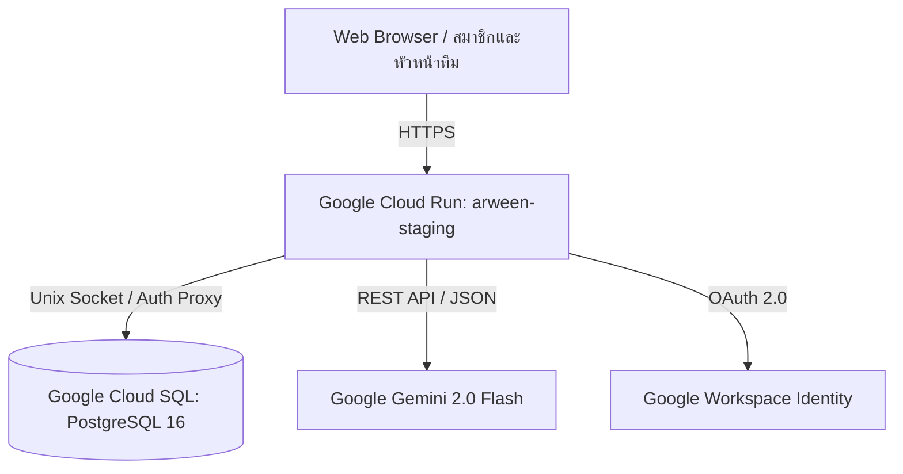

# คู่มือการขึ้นระบบ Cloud Staging (Google Cloud Run + Cloud SQL PostgreSQL)

เอกสารนี้อธิบายสถาปัตยกรรมและการ Deploy ระบบ ARWEEN ขึ้นสู่สภาพแวดล้อม Cloud Staging จริงบน Google Cloud Platform

---

## 1. สถาปัตยกรรมระบบ (Cloud Architecture)



- **Compute**: Google Cloud Run (Containerized Next.js 14 Standalone บน Node.js 20 Alpine)
- **Database**: Google Cloud SQL (PostgreSQL 16, Region: `asia-southeast1`, Instance: `arween-db-staging`)
- **Connection**: Cloud SQL Auth Proxy Unix Socket (`/cloudsql/<PROJECT_ID>:<REGION>:<INSTANCE_NAME>`)
- **AI Engine**: Google Gemini (`gemini-3.6-flash`)
- **Authentication**: NextAuth.js (รองรับทั้ง Credentials สำหรับบัญชีสาธิต และ Google OAuth)

---

## 2. สิ่งที่เตรียมพร้อมไว้แล้วในโปรเจกต์

1. [`cloudbuild.yaml`](../cloudbuild.yaml) — สำหรับการคอมไพล์ Production Image อัตโนมัติด้วย Google Cloud Build
2. [`scripts/sync-prisma-provider.js`](../scripts/sync-prisma-provider.js) — สลับ Prisma Provider ระหว่าง SQLite (โลคอล) และ PostgreSQL (Cloud SQL) อัตโนมัติโดยตรวจจับจาก `DATABASE_URL`
3. [`Dockerfile`](../Dockerfile) — Multi-stage Build ปรับปรุง Standalone Output ให้มีขนาดกะทัดรัดและปลอดภัย
4. [`scripts/docker-entrypoint.sh`](../scripts/docker-entrypoint.sh) — รัน `prisma db push` อัตโนมัติขณะบูตคอนเทนเนอร์บน Cloud Run ก่อนเปิดรับ Traffic
5. สคริปต์คำสั่ง Deploy 1-Click:
   - สำหรับ Windows: [`scripts/deploy-cloud-staging.bat`](../scripts/deploy-cloud-staging.bat)
   - สำหรับ Linux / macOS / Cloud Shell: [`scripts/deploy-cloud-staging.sh`](../scripts/deploy-cloud-staging.sh)

---

## 3. ขั้นตอนการ Deploy สู่ Cloud Staging

### ขั้นที่ 1: ตรวจสอบและตั้งค่าบัญชี Google Cloud (Authentication & ADC)
ตรวจสอบโปรเจกต์ Google Cloud และบัญชีที่ใช้งาน:
```cmd
gcloud config get-value account
gcloud config get-value project
gcloud config set project gen-lang-client-0084061289
```
(โปรเจกต์เป้าหมายสำหรับ Staging คือ `gen-lang-client-0084061289`)

**การตั้งค่า Application Default Credentials (ADC):**
หากยังไม่ได้ตั้งค่า Application Default Credentials ให้รันคำสั่ง setup script:
```bash
bash <(curl -sSL https://storage.googleapis.com/cloud-samples-data/adc/setup_adc.sh)
```
หรือล็อกอินผ่าน gcloud CLI:
```cmd
gcloud auth application-default login
```

**GCP Credentials Management Console:**
- จัดการ API Keys และ OAuth 2.0 Credentials: [https://console.cloud.google.com/apis/credentials?project=gen-lang-client-0084061289&folder=&organizationId=](https://console.cloud.google.com/apis/credentials?project=gen-lang-client-0084061289&folder=&organizationId=)

### ขั้นที่ 2: รันคำสั่ง Deploy
เปิด Terminal แล้วรัน:
```cmd
scripts\deploy-cloud-staging.bat
```
*(หรือรัน `bash scripts/deploy-cloud-staging.sh` บน Linux/Mac)*

สคริปต์จะดำเนินการให้อัตโนมัติ:
1. ตั้งค่า Project เป็น `gen-lang-client-0084061289`
2. เปิด API `run.googleapis.com`, `sqladmin.googleapis.com`, `cloudbuild.googleapis.com`, `containerregistry.googleapis.com`
3. สร้าง Cloud SQL PostgreSQL 16 (ถ้ายังไม่มี)
4. ส่ง Source Code ขึ้น Cloud Build เพื่อสร้าง Container Image
5. Deploy คอนเทนเนอร์ขึ้น Cloud Run พร้อมผูก `--add-cloudsql-instances`
6. ส่งคืน URL สำหรับเข้าใช้งานจริง เช่น: `https://arween-staging-XXXXX.asia-southeast1.run.app`

---

## 4. ตัวแปรสภาพแวดล้อมบน Cloud Run (Environment Variables)

| ตัวแปร | ตัวอย่างค่า | คำอธิบาย |
| :--- | :--- | :--- |
| `DATABASE_URL` | `postgresql://arween_user:PASS@/arween?host=/cloudsql/PROJECT:REGION:INSTANCE` | ชี้ไปยัง Cloud SQL ผ่าน Unix socket |
| `NEXTAUTH_URL` | `https://arween-staging-XXXXX.asia-southeast1.run.app` | URL หลักของ Cloud Run Service |
| `NEXTAUTH_SECRET` | *(Random 32-char string)* | คีย์เข้ารหัสเซสชัน |
| `GEMINI_API_KEY` | `AQ.Ab8RN6...` | Google AI Studio Key สำหรับ Agent 1-3 |
| `GEMINI_MODEL` | `gemini-3.6-flash` | โมเดล Gemini มาตรฐานที่เสถียร |
| `GOOGLE_CLIENT_ID` | `...apps.googleusercontent.com` | (ทางเลือก) สำหรับ Google OAuth สมาชิกจริง |
| `GOOGLE_CLIENT_SECRET` | `GOCSPX-...` | (ทางเลือก) Secret ของ Google OAuth |

---

## 5. แหล่งข้อมูลภายนอกและลิงก์ระบบที่เกี่ยวข้อง (Repository & AI Studio)

| บริการ | ข้อมูล / ลิงก์ | หมายเหตุ |
| :--- | :--- | :--- |
| **Google Cloud Project ID** | `gen-lang-client-0084061289` | โปรเจกต์หลักสำหรับ Cloud Run และ Cloud SQL Staging |
| **GCP Credentials Console** | [https://console.cloud.google.com/apis/credentials?project=gen-lang-client-0084061289&folder=&organizationId=](https://console.cloud.google.com/apis/credentials?project=gen-lang-client-0084061289&folder=&organizationId=) | จัดการ API Keys และ OAuth 2.0 Client IDs |
| **ADC Setup Command** | `bash <(curl -sSL https://storage.googleapis.com/cloud-samples-data/adc/setup_adc.sh)` | ติดตั้ง Application Default Credentials |
| **GitHub Remote Repository** | [https://github.com/thanamethawat-cmyk/arween.git](https://github.com/thanamethawat-cmyk/arween.git) | Git Remote หลักของโครงการ |
| **Google AI Studio Applet** | [https://ai.studio/apps/1bdf71c7-3126-41cd-b982-db6c1361ae64?fullscreenApplet=true](https://ai.studio/apps/1bdf71c7-3126-41cd-b982-db6c1361ae64?fullscreenApplet=true) | AI Applet ต้นแบบบน Google AI Studio |

